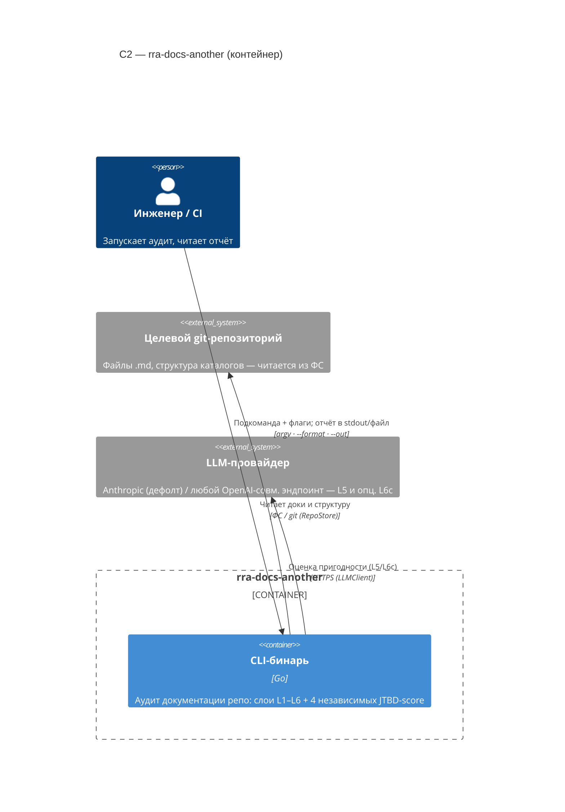
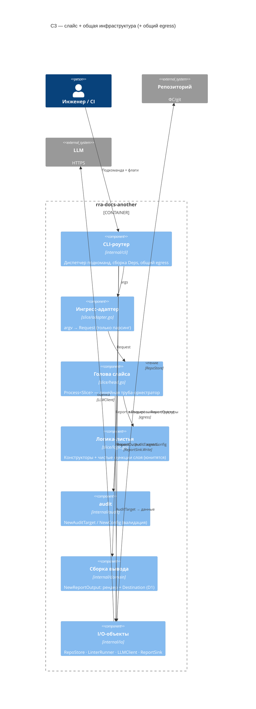

# C4 + системный use case — rra-docs-another

Модель C4 инструмента по уровням (skill `documentation` Pass B3/B4, `program-design`
Шаг 10). **C1** (System Context экосистемы RRA) — на лэндинге мета-репо `rra`, не
здесь. Ниже — **C2** (контейнер), **C3** (дерево модулей слайса, = `infrastructure.md`)
и **системные use case по Коберну** (C4-уровень «как работает программа»).

Связь жёсткая: **1 слайс = 1 внешний вход (CLI-подкоманда) = 1 use case**; каждый
Extension `NNa` = один компонентный Gherkin-сценарий (`program-design` Шаг 8.6,
`component-tests` «Формула»). Per-slice use case'ы живут в карточках `slices/NN-*.md`;
здесь — интеграционный `assess` и сквозной `egress`.

## C2 — контейнер

Внешний линтер (Vale/markdownlint, L2) — отложенный слайс S4 (TBD), в C2 пока не
поднят. Секретов в контейнере нет: LLM-ключ берётся из env по имени переменной.

## C3 — дерево модулей слайса (компонент)

Все 7 слайсов имеют одну форму; общая инфраструктура — в `internal/{cli,audit,io,domain}`.

Голова — труба без ветвлений; запись отчёта и код возврата вынесены в **общий
egress** роутера (`Egress`), не в голову. Развилки «формат/назначение» (`req.Format`,
`req.Out`) решаются чистой логикой `NewReportOutput` и юнитятся — не I/O и не
side-инъекция (урок дефекта D1, см. [`egress.md`](egress.md)).

## UC-assess — оценить качество документации репозитория

- **Первичный актор:** инженер / CI-пайплайн.
- **Заинтересованные стороны:** четыре JTBD-потребителя (создатель, потребитель,
  менеджер, ИИ-агент) — каждый хочет, чтобы доки закрывали его работу; оператор CI —
  хочет детерминированный код возврата как гейт.
- **Предусловия:** путь указывает на доступную директорию git-репозитория.
- **Триггер:** `rra-docs-another assess <path> [--format] [--out] [--up-to]`.
- **Основной успешный сценарий:**
  1. Адаптер парсит argv в `Request`.
  2. `NewAuditTarget` валидирует путь; `RepoStore` читает структуру и `.md`.
  3. Дешёвые слои без ИИ: L1 (читаемость), L3 (структура), L4 (присутствие JTBD),
     L6a (дрейф) считаются чистыми листьями.
  4. Если документация есть (`hasDocs`) — L5 (`fitness`) запрашивает у LLM четыре
     независимых вердикта; `capL5ByL4` ограничивает итог сверху при провале статики.
  5. `mergeOutcomes` собирает отчёт: слои + четыре несреднённых JTBD-score + пробелы.
  6. Egress пишет отчёт в `req.Out` в формате `req.Format`; код возврата `0`
     (чисто) или `1` (есть блокер-нарушение или JTBD `FAIL`).
- **Гарантии успеха:** четыре score раздельны; отчёт валиден по `report.schema.json`.
- **Минимальная гарантия:** при любом отказе — `errors[]` + код `2`, деградация
  видна, не маскируется под успех.

**Extensions (= режимы отказа, 1:1 с Gherkin-сценариями отказа):**

| Ext | Условие | `error.code` / исход | Код | Gherkin |
|---|---|---|---|---|
| 2a | путь не существует | `path_not_found` | 2 | `assess.feature` «путь не существует» |
| 4a | LLM недоступен/лимит/бюджет | `llm_unavailable` / `llm_rate_limited` / `llm_budget_exceeded` | 2 | `fitness.feature` (наследуется L5) |
| 6a | запись отчёта не удалась | `report_write_failed` | 2 | `egress.feature` (см. UC-egress) |

Альтернативные **успешные** исходы (`PARTIAL` при частичном провале статики, `FAIL`
JTBD при годной доке) — это варианты основного сценария (оценка **выполнена**),
не extensions: они дают код `0/1`, не `2`. Покрыты `assess.feature` (repo-soft,
repo-bad).

## UC-egress — записать отчёт (сквозной)

Общий выход для всех подкоманд (`program-design` Шаг 3, «общий egress»).

- **Первичный актор:** инженер / CI (через любую подкоманду).
- **Предусловия:** слайс вернул `Report` (успех или `errors[]`).
- **Основной успешный сценарий:**
  1. `NewReportOutput(report, req)` рендерит отчёт по `req.Format` (json/md) и
     резолвит `req.Out` в `Destination` (`-`/"" → stdout, иначе файл).
  2. `ReportSink.Write(out)` пишет байты в назначение.
  3. Код возврата вычисляется по содержимому отчёта (`exitCode`).
- **Гарантии успеха:** отчёт целиком записан в `req.Out`; `--out -` → stdout,
  `--out <файл>` → файл (исправление D1: раньше `--out` был no-op).

**Extensions:**

| Ext | Условие | `error.code` | Код | Gherkin |
|---|---|---|---|---|
| 1a | неизвестный `--format` | `format_invalid` | 2 | юнит `NewReportOutput` (развилка по полю, не компонент) |
| 2a | путь `--out` недоступен | `report_write_failed` | 2 | `egress.feature` «запись в недоступный путь» |

Развилки `stdout\|файл × json\|md` — **юниты** (`resolveDestination`/`renderReport`/
`NewReportOutput`), в компонентную формулу `N = 1 + #extensions` не входят; в
`egress.feature` — только различимый режим **отказа** записи (граница со слоем
юнитов, `component-tests`).
